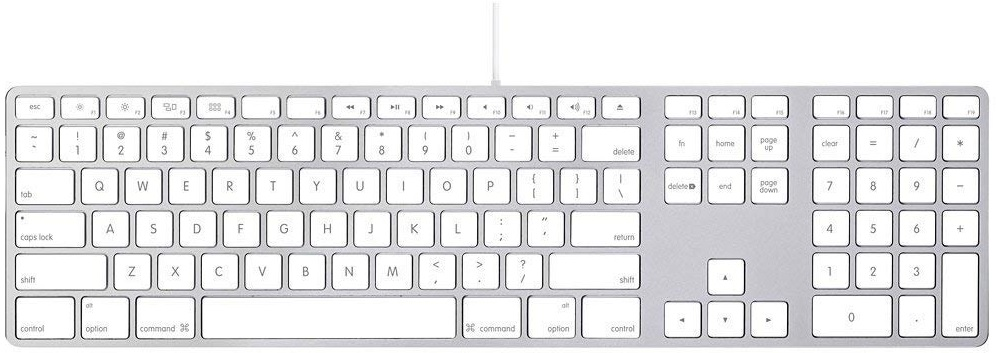

# Apple Aluminium Wired Keyboard driver
This driver allows for the keyboard to be used without losing your mind.
Based on the [Interception driver](https://github.com/oblitum/Interception)



Mappings:
- left alt -> Win key
- left cmd -> alt
- right cmd -> alt
- right alt -> menu
- F13 -> insert
- F14 -> volume down
- F15 -> volume up

These can be customized in code.

Currently only the ISO2 version of the keyboard is recognised, however others could be added relatively easily in the code.

## Installation
1) Install the [Interception](https://github.com/oblitum/Interception) driver by running 
```
install-interception.exe /install
```

in a command line with *Administrator privileges.*

2) Build applekeyboard2
3) Add applekeyboard as a service
```
sc create applekeyboard2 binpath="c:\absolute\path\to\applekeyboard2.exe"
sc config applekeyboard2 start=auto
```
Note that you must have quotation marks around the actual exe path.

4) Run the service
```
sc start applekeyboard2
```


